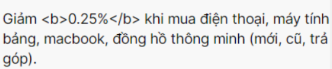

## 1.Example type code:

### 1.1 Shit code example:



### 1.2 Golden code example:


## 2.How to fix:

```jsx title="src/pages/my-react-page.js
const bien = `test <b> bold </b>`;
<div dangerouslySetInnerHTML={{ __html: bien }}></div>;
```

### 3.Example code:


